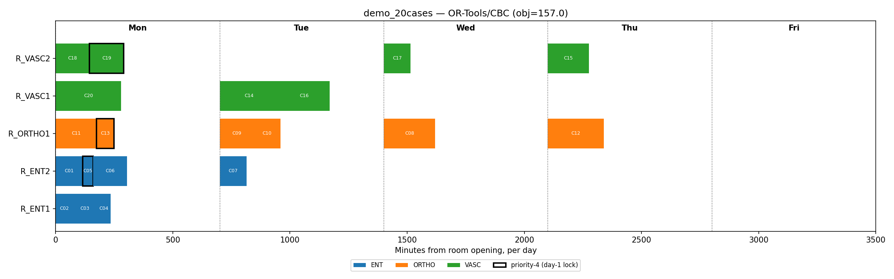

# Results

What the demo actually produces, and why it backs up the CP-over-MILP argument in
FORMULATION.md §3. Reproducible with `python main.py --instance {demo,medium}
--benchmark`.

Environment: Windows, Python 3.12, `ortools` 9.x (CBC bundled, CP-SAT), `gurobipy`
available locally (optional, falls back to CBC if missing), `docplex` + a CP Optimizer
engine available locally (optional, falls back to CP-SAT if missing). A note before any
numbers: every solver below reports "Optimal" once it has proven the result within its
configured relative gap, which is shown explicitly and is not always a literal 0%.
Treat the gap column as part of the answer, not a footnote.

## Demo instance: 20 cases, 5 rooms, 6 surgeons

`python main.py --instance demo --benchmark --gap 0.0001`:

| Solver | Status | Objective | Gap | Scheduled | Time |
|---|---|---|---|---|---|
| **CP-SAT (primary model)** | Optimal | **155.0** | 0.00% | 20/20 | ~0.1s |
| OR-Tools/CBC (comparison MILP) | Optimal | 157.0 | 0.00% | 20/20 | ~0.03s |
| Gurobi (comparison MILP) | Optimal | 157.0 | 0.00% | 20/20 | ~0.6s |
| CP Optimizer (appendix) | Optimal | 155.0 | 0.00% | 20/20 | ~1.1s |

Everything closes to a verified zero gap in well under two seconds at this size, so this
instance is mostly a correctness check. One thing is worth highlighting because it makes
the §3 argument concrete rather than asserted: the demo has one shared C-arm with
capacity 1, used by four cases (C14, C15, C17, C19). The comparison MILP's C10 counts
cases per day against that capacity, so it spreads the four across four different days,
one each. CP-SAT's `AddCumulative` checks literal time overlap instead, and its optimal
schedule puts two of them (C15 and C17) on the same day in sequence, never exceeding
one concurrent use:

```
CP-SAT  : Mon=[C19]  Tue=[C15, C17]  Wed=[C14]
CBC     : Mon=[C19]  Tue=[C15]       Wed=[C17]   Thu=[C14]
```

That placement is exactly what the MILP's day-count cap forbids by construction: not a
worse search, but a smaller feasible region. The 155 vs. 157 difference on the objective
is the direct consequence.

## Scaling: 200 cases, 12 rooms, 17 surgeons

**Step 1: the comparison MILP's true optimum**, via Gurobi at a near-zero gap
(`--solver milp-gurobi --gap 0.0005`): **74,074.0**, 130/200 scheduled, in well under a
second. This is the number everything below is measured against.

**Step 2: a 2-minute budget, 1% gap target, CP-SAT vs. the open-source MILP backend**
(`--time-limit 120 --gap 0.01`):

| Solver | Status | Objective | Own Gap | vs. True MILP Optimum | Scheduled | Time |
|---|---|---|---|---|---|---|
| OR-Tools/CBC | Feasible | 74,116.0 | 0.56% | +0.06% | 130/200 | 120.2s |
| **CP-SAT (primary model)** | Feasible | **69,956.0** | 6.62% | **-5.56%** | **131/200** | 124.5s |

CBC essentially reaches the MILP's own true optimum in the 2-minute budget (Gurobi
proves the same formulation's optimum over 100x faster with the same math). CP-SAT
does not just fail to beat that bound; it finds a genuinely different, better schedule
below it while scheduling one more case, for the same reason as the demo instance's
C-arm story at production scale: the MILP's day-level equipment cap and aggregate
room/surgeon sums forbid schedules that CP-SAT's `NoOverlap`/`Cumulative` constraints
correctly allow.

CP-SAT's own gap (6.62%) is looser than CBC's, and that is not a contradiction. A
smaller feasible region is mechanically easier to close a gap on, the same way it is
easier to prove there is no number above 5 in {1,...,5} than in {1,...,100}. The loose
gap means there is likely a better schedule than 69,956 still unfound at this budget,
not that the search performed poorly.

This is a quick illustrative run, not an exhaustive proof a real capacity-planning
decision would warrant. A production comparison would give each backend the planning
team's actual budget (half an hour to overnight) and report variance across seeds, not
a single 2-minute run.

## CP Optimizer at scale

Not benchmarked at the medium-instance scale here. FORMULATION.md's appendix reports an
honest comparison at 120 seconds (more cases scheduled than CP-SAT, but a markedly worse
objective and far looser gap, most likely because no custom search phase or warm start
was applied). It remains an appendix backend, not a second deliverable.

## Visual schedule

`python main.py --instance <name> --solver cp-sat --plot out.png`
(`src/utils/visualizer.py`). Each bar is one case; outlined bars are priority-4 (locked
to day 1); colors are surgical service.

**Demo instance, CP-SAT:** real start/end clock times; two C-arm cases land on Tuesday,
sequentially in the same room:


**Demo instance, comparison MILP:** same cases, no exact clock times (this formulation
has no start-time variable; cases within a room-day are laid out back-to-back for
display only), and its four C-arm cases spread one per day across four different days:


