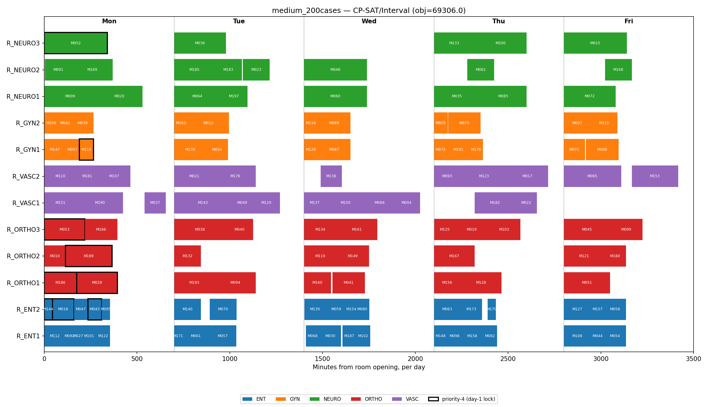
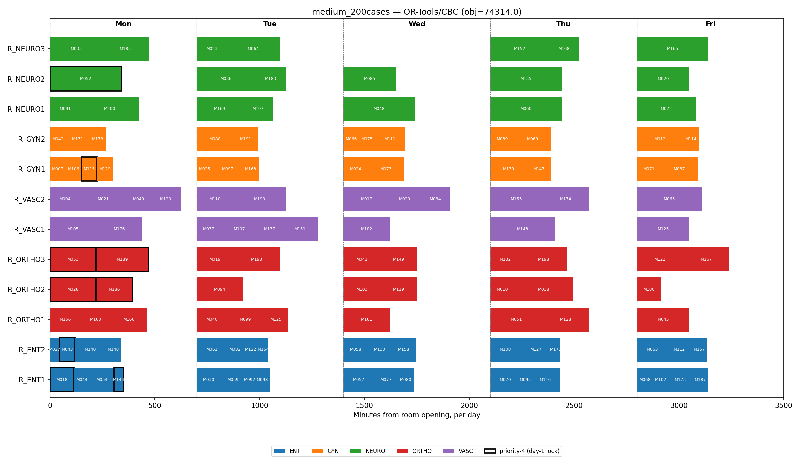

# Results

What the demo actually produces, and why it backs up the CP-over-MILP argument in
FORMULATION.md §3. Reproducible with `python main.py --instance {demo,medium}
--benchmark`.

Environment: Windows, Python 3.12, `ortools` 9.x (CBC bundled, CP-SAT), `gurobipy`
available locally (optional, falls back to CBC if missing), `docplex` + a CP Optimizer
engine available locally (optional, falls back to CP-SAT if missing). A note before any
numbers: every solver below reports "Optimal" once it has proven the result within its
configured relative gap, which is shown explicitly and is not always a literal 0%.
Treat the gap column as part of the answer, not a footnote.

## Demo instance: 20 cases, 5 rooms, 6 surgeons

`python main.py --instance demo --benchmark --gap 0.0001`:

| Solver | Status | Objective | Gap | Scheduled | Time |
|---|---|---|---|---|---|
| **CP-SAT (primary model)** | Optimal | **155.0** | 0.00% | 20/20 | ~0.1s |
| OR-Tools/CBC (comparison MILP) | Optimal | 157.0 | 0.00% | 20/20 | ~0.03s |
| Gurobi (comparison MILP) | Optimal | 157.0 | 0.00% | 20/20 | ~0.6s |
| CP Optimizer (appendix) | Optimal | 155.0 | 0.00% | 20/20 | ~1.1s |

Everything closes to a verified zero gap in well under two seconds at this size, so this
instance is mostly a correctness check. One thing is worth highlighting because it makes
the §3 argument concrete rather than asserted: the demo has one shared C-arm with
capacity 1, used by four cases (C14, C15, C17, C19). The comparison MILP's C10 counts
cases per day against that capacity, so it spreads the four across four different days,
one each. CP-SAT's `AddCumulative` checks literal time overlap instead, and its optimal
schedule puts two of them (C15 and C17) on the same day in sequence, never exceeding
one concurrent use:

```
CP-SAT  : Mon=[C19]  Tue=[C15, C17]  Wed=[C14]
CBC     : Mon=[C19]  Tue=[C15]       Wed=[C17]   Thu=[C14]
```

That placement is exactly what the MILP's day-count cap forbids by construction: not a
worse search, but a smaller feasible region. The 155 vs. 157 difference on the objective
is the direct consequence.

## Scaling: 200 cases, 12 rooms, 17 surgeons

**Step 1: the comparison MILP's true optimum**, via Gurobi at a near-zero gap
(`--solver milp-gurobi --gap 0.0005`): **74,074.0**, 130/200 scheduled, in well under a
second. This is the number everything below is measured against.

**Step 2: a 2-minute budget, 1% gap target, CP-SAT vs. the open-source MILP backend**
(`--time-limit 120 --gap 0.01`):

| Solver | Status | Objective | Own Gap | vs. True MILP Optimum | Scheduled | Time |
|---|---|---|---|---|---|---|
| OR-Tools/CBC | Feasible | 74,116.0 | 0.56% | +0.06% | 130/200 | 120.2s |
| **CP-SAT (primary model)** | Feasible | **69,956.0** | 6.62% | **-5.56%** | **131/200** | 124.5s |

CBC essentially reaches the MILP's own true optimum in the 2-minute budget (Gurobi
proves the same formulation's optimum over 100x faster with the same math). CP-SAT
does not just fail to beat that bound; it finds a genuinely different, better schedule
below it while scheduling one more case, for the same reason as the demo instance's
C-arm story at production scale: the MILP's day-level equipment cap and aggregate
room/surgeon sums forbid schedules that CP-SAT's `NoOverlap`/`Cumulative` constraints
correctly allow.

CP-SAT's own gap (6.62%) is looser than CBC's, and that is not a contradiction. A
smaller feasible region is mechanically easier to close a gap on, the same way it is
easier to prove there is no number above 5 in {1,...,5} than in {1,...,100}. The loose
gap means there is likely a better schedule than 69,956 still unfound at this budget,
not that the search performed poorly.

This is a quick illustrative run, not an exhaustive proof a real capacity-planning
decision would warrant. A production comparison would give each backend the planning
team's actual budget (half an hour to overnight) and report variance across seeds, not
a single 2-minute run.

## CP Optimizer at scale

Not benchmarked at the medium-instance scale here. FORMULATION.md's appendix reports an
honest comparison at 120 seconds (more cases scheduled than CP-SAT, but a markedly worse
objective and far looser gap, most likely because no custom search phase or warm start
was applied). It remains an appendix backend, not a second deliverable.

## CP-SAT vs. MIP: trade-offs

The numbers above favor CP-SAT on this problem, but that's a claim about *this*
problem's structure (disjunctive resource scheduling), not a universal ranking. The
honest trade-off, both directions:

| | CP-SAT wins | MIP wins |
|---|---|---|
| **Expressing "no two things overlap"** | Native (`NoOverlap`/`Cumulative`), no extra variables, no big-M | Needs a binary + big-M per conflicting pair; grows quadratically and weakens the LP relaxation as pairs grow (§3) |
| **Proving optimality on this instance** | — | MIP's LP relaxation gives a genuinely tighter bound here: CBC closes to 0.56% gap in 2 minutes, CP-SAT only to 6.62% on the same budget (this file, §"Scaling"). CP-SAT finds the *better* schedule but proves it *less tightly* |
| **Continuous costs / fractional values** | — | MIP variables are naturally continuous; CP-SAT is integer-only, every objective coefficient here gets rounded before solving (FORMULATION_CP.md §3). A model leaning heavily on real-valued costs (staffing overtime pay, $/minute trade-offs) fits MIP more naturally |
| **Diagnosing infeasibility / sensitivity** | — | Commercial MIP solvers (Gurobi, CPLEX) expose duals, IIS (irreducible infeasible sets), and sensitivity ranges out of the box, standard tooling for an ops-research team doing "what if we added a room" studies. CP-SAT's propagation-based search doesn't produce these the same way |
| **Tooling maturity / ecosystem** | Free, no license, ships with OR-Tools | Gurobi/CPLEX represent decades of commercial tuning and are the default vocabulary in most OR teams already, worth weighing against CP-SAT's zero license cost |
| **Adding a side constraint expressed as a linear sum** | Also fine, `Add(sum(...) <= k)` works identically in both | Arguably the MIP's native idiom: cutting-plane theory is built around linear inequalities, so a team already fluent in MIP modeling may extend a MIP formulation faster |

The practical read for this project: CP-SAT was the right call *because* the problem's
hard part is genuinely disjunctive (rooms, surgeons, a shared C-arm, all "one thing at a
time" resources), not because CP-SAT is unconditionally stronger. A problem dominated by
continuous cost trade-offs, or one needing sensitivity analysis for a budget conversation
with hospital finance, would tilt the other way, and that's the kind of judgment call §14
tries to systematize: argue the backend from the problem's structure, then check it
empirically, rather than defaulting to one tool.

## Visual schedule

`python main.py --instance <name> --solver cp-sat --plot out.png`
(`src/utils/visualizer.py`). Each bar is one case; outlined bars are priority-4 (locked
to day 1); colors are surgical service. Below, each chart is read the way a planner
would read it, not the way a solver would.

**Demo instance, CP-SAT** (obj 155.0):


For a planner: Friday is empty, that's real spare capacity a planner could hold back
for add-ons rather than a wasted day. Rooms run back-to-back with no dead time (e.g.
R_VASC2 Monday: three cases in a row), and the priority-4 cases (outlined) all sit first
thing Monday, as they must. The detail a whiteboard planner would likely miss: the two
C-arm cases on Tuesday (in R_VASC1) run one after the other in the same room, because
the model checked they don't need the machine at the same clock time, not just that
they're both "on Tuesday."

**Demo instance, comparison MILP** (obj 157.0):


Same 20 patients, same rooms, but the four C-arm cases are now spread one per day across
four separate days instead of sharing Tuesday. To a planner this looks like a more
"cautious" schedule, but it isn't buying anything clinically: it's blocking a
perfectly safe same-day pairing because this version of the tool only counts how many
C-arm cases fall on a day, not whether their actual times overlap. Note also there are
no gaps drawn between cases here, this version doesn't plan clock times at all, only
day-and-room, so it isn't something you could hand to staff as-is without a further
sequencing pass.

**Medium instance, CP-SAT** (~200 cases, 131 scheduled):



This is closer to what a real week looks like: 12 rooms, 5 services, most days packed
tight. A planner scanning this for spare capacity would look at the short bars and gaps,
R_VASC1 is empty Thursday, R_NEURO2 has almost nothing Thursday, that's where an urgent
add-on would land without displacing anyone already booked. ORTHO and NEURO carry the
heaviest load all week, which is the kind of thing that tells a planner where a
service is structurally short on room-time, not just having a busy week.

**Medium instance, comparison MILP:**



Visually this looks almost the same as the CP-SAT chart above, similar packing, similar
case counts per room. That's the point worth flagging to a planner: two schedules can
look nearly identical on a Gantt chart and still differ by several thousand points of
objective and a full patient scheduled or not (RESULTS.md, medium-instance table),
because the difference lives in which equipment/room clashes were checked correctly, not
in how full the rooms look on the page. A Gantt chart alone doesn't tell you which
schedule is actually better; the numbers behind it do.
